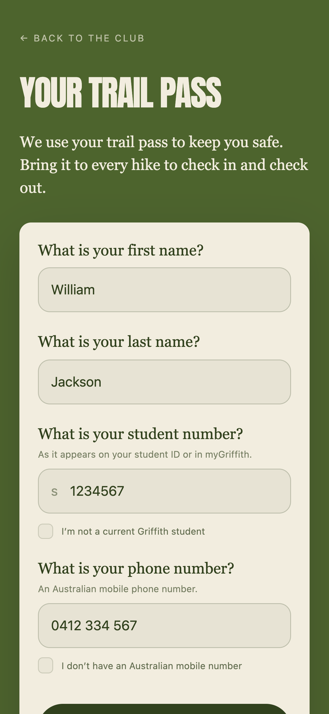
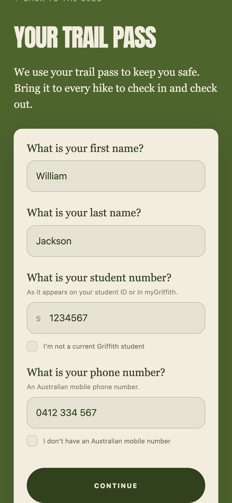
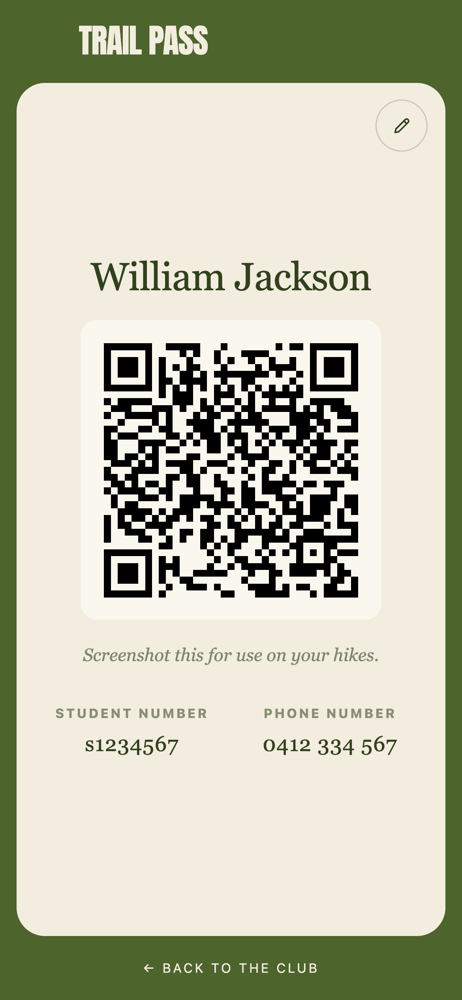

# Griffith Hiking Club

The website for Griffith University's Hiking Club. Upcoming hikes, weekends from the trail, and a QR Trail Pass for checking in and out when there's no signal.

[Visit griffithhiking.club](https://griffithhiking.club)

[](docs/media/homepage.png)

## On mobile

Photos from the club's weekends and a Trail Pass you can keep on your phone.

<p>
  <a href="docs/media/instagram-mobile.png"></a>
</p>

### Trail Pass

Enter your details, continue, and keep the QR pass for your next hike. Example details shown below.

<p>
  <a href="docs/media/trail-pass-details.png"></a>
  <a href="docs/media/trail-pass-continue.png"></a>
  <a href="docs/media/trail-pass-ready.png"></a>
</p>

## Run locally

Built with Astro, TypeScript and Tailwind CSS. Sanity manages the hike calendar.
Requires Node.js 22.12+ and pnpm.

```sh
pnpm install
pnpm dev --background
```

Open [localhost:4321](http://localhost:4321). The calendar reads the public Sanity dataset configured in `sanity.project.json`.

[CMS](docs/cms.md) · [Offline scanner](docs/scanner.md) · [Deployment](docs/deploy.md)
