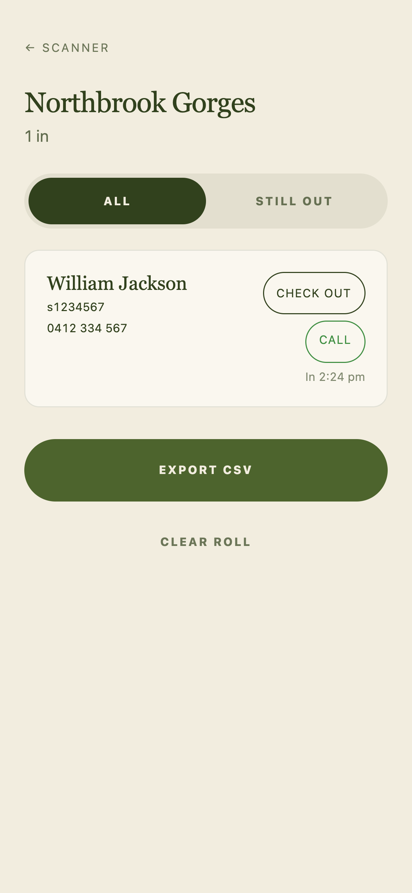

# Griffith Hiking Club

The website for Griffith University's Hiking Club. Upcoming hikes, weekends from the trail, and a QR Trail Pass for checking in and out when there's no signal.

[Visit griffithhiking.club](https://griffithhiking.club)

<table>
  <tr>
    <td width="75%"><a href="docs/media/homepage.png"></a></td>
    <td width="25%"><a href="docs/media/instagram-mobile.png"></a></td>
  </tr>
</table>

## Trail Pass, without reception

Many of our hikes have no phone signal. Hikers make their Trail Pass before leaving and save a screenshot. The QR code carries their details, so leaders can check people in and out without an internet connection.

Install and open the [Attendance scanner](https://griffithhiking.club/scan/) while online before the hike. It then works offline, keeps the roll on the leader's phone, and shows who still needs to check out.

Enter your details, continue, and keep the QR pass for your next hike. Example details shown below.

<p>
  <a href="docs/media/trail-pass-details.png"></a>
  <a href="docs/media/trail-pass-continue.png"></a>
  <a href="docs/media/trail-pass-ready.png"></a>
</p>

### At the trailhead

Pick the hike → scan passes to check in → scan again to check out. Add anyone without a pass by hand. The attendance roll below is shown with the browser offline.

<p>
  <a href="docs/media/scanner-roll.png"></a>
</p>

## Run locally

Built with Astro, TypeScript and Tailwind CSS. Sanity manages the hike calendar.
Requires Node.js 22.12+ and pnpm.

```sh
pnpm install
pnpm dev --background
```

Open [localhost:4321](http://localhost:4321). The calendar reads the public Sanity dataset configured in `sanity.project.json`.

[CMS](docs/cms.md) · [Offline scanner](docs/scanner.md) · [Deployment](docs/deploy.md)
